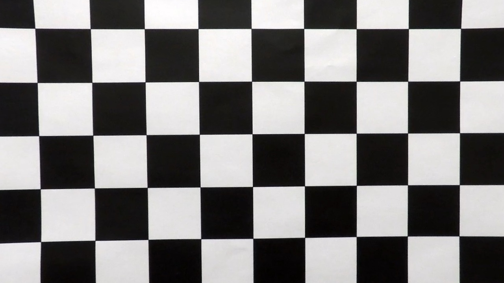
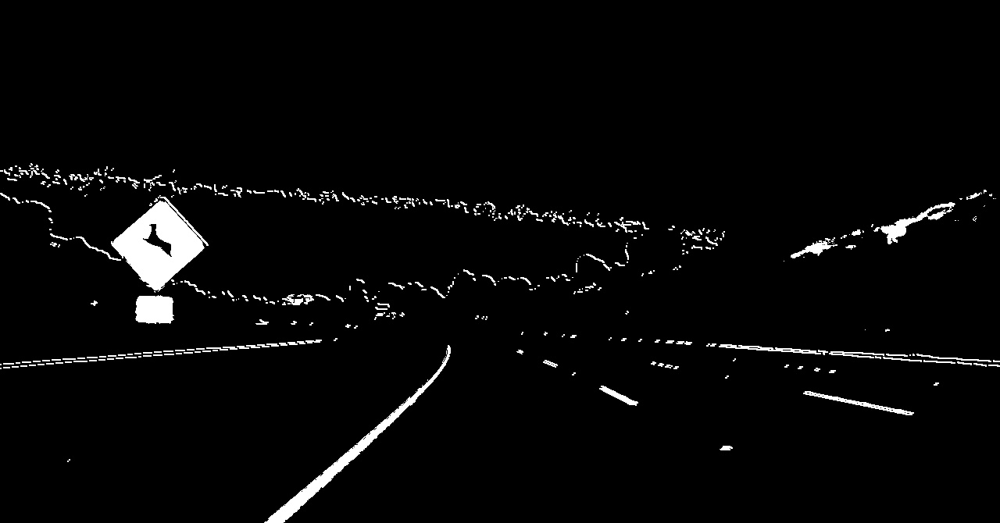
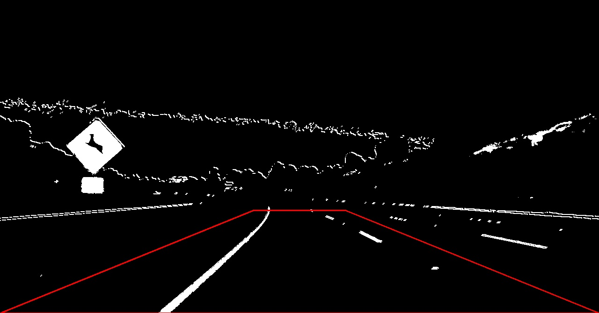
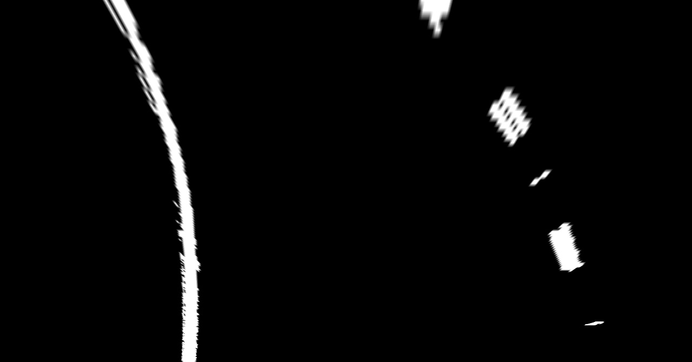
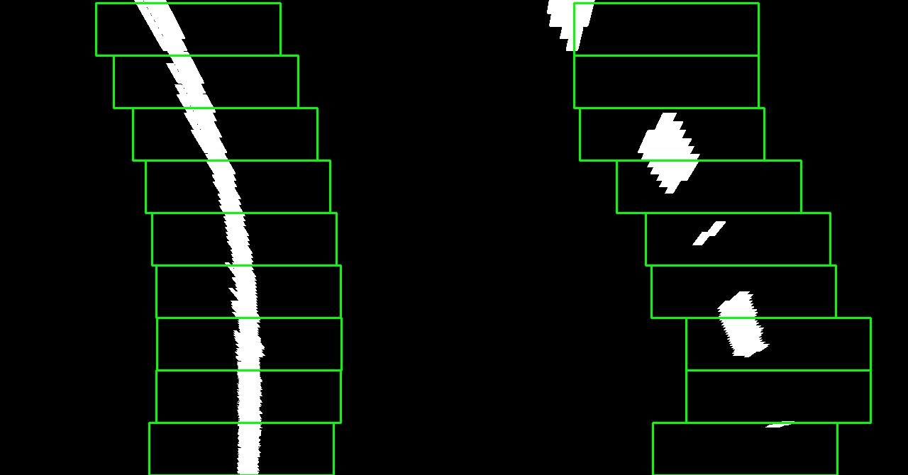
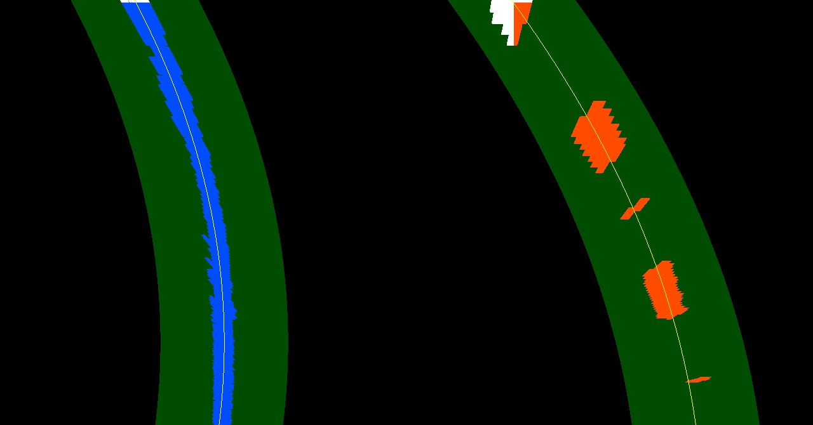
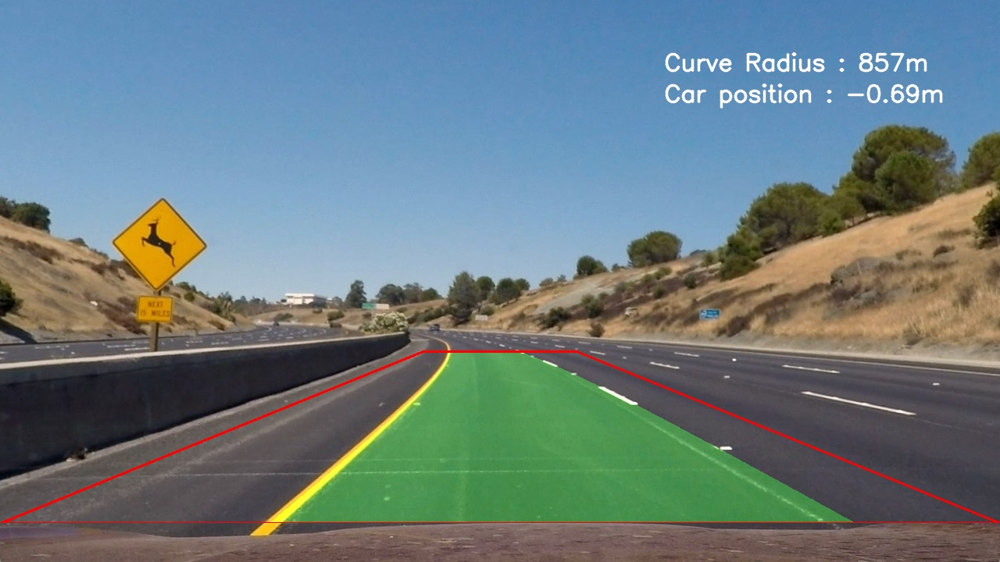

## Advanced Lane Finding

The goals / steps of this project are the following:

* Compute the camera calibration matrix and distortion coefficients given a set of chessboard images.
* Apply a distortion correction to raw images.
* Use color transforms, gradients, etc., to create a thresholded binary image.
* Apply a perspective transform to rectify binary image ("birds-eye view").
* Detect lane pixels and fit to find the lane boundary.
* Determine the curvature of the lane and vehicle position with respect to center.
* Warp the detected lane boundaries back onto the original image.
* Output visual display of the lane boundaries and numerical estimation of lane curvature and vehicle position.

There are 4 files to run this project:
* main.py
* lane_data.py
* image_processing.py
* camera_data.py

The first step is calibrate the camera. The images for camera calibration are stored in the folder called `camera_cal`. I used the project https://github.com/udacity/CarND-Camera-Calibration as reference to perform the calibration.

The camera matrix and distortion coefficients are stored in a binary file. 
Here is the result:

 

More info in the function camera_data.perform_calibration()

The pipeline has 4 steps:
* Apply thresholds
* Warp image
* Lane detection
* Get info

The function find_driving_lanes() has the needed operations to detect the edges. I used the channels Red and Green, Lumminance and Saturation, and applied sobel gradient.
The result is shown below:

The next step is to get Bird-View. The ROI points are decided setting up a focal point, an Y-offset and 2 base-points(heer I used the bottom points). The warped image:
 

Now the function lane_detection() is called to find where are the lanes. Nested in this function, is the function find_lane_pixels(), that is called at first-time run or when the search_around_poly() fails to find the lanes with the previous results.
The histogram is used to split the image and start to search the lane around rectangles boxes:

 

With these result, it is possible to get information like curve radius and the car position related to center of the lane. The function measure_curvature_real() calculates the average between the right and the left lane. As the camera is mounted in the car center, we can calculate the difference between the average of the two lanes found and the image center. The final result is shown below:

### Improvements:
The pipeline does not work well with shadows. The threshold or other algorithms can be used to perform more robust lane detection.